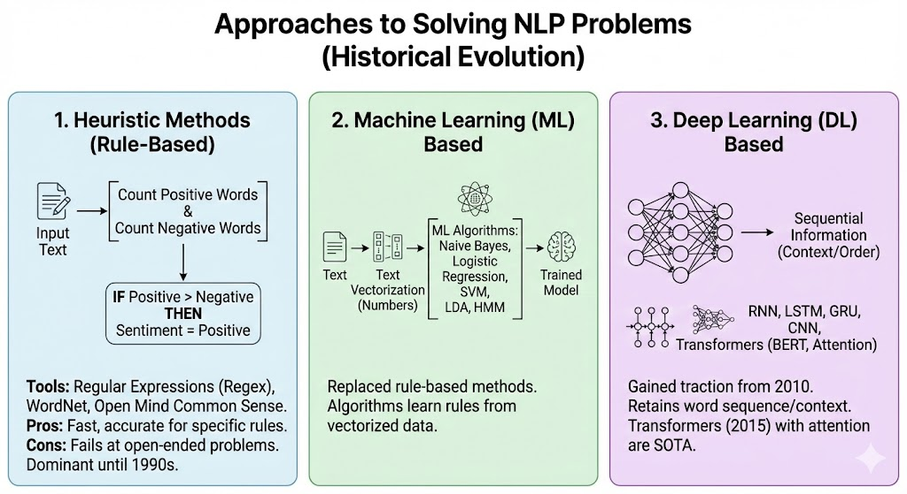
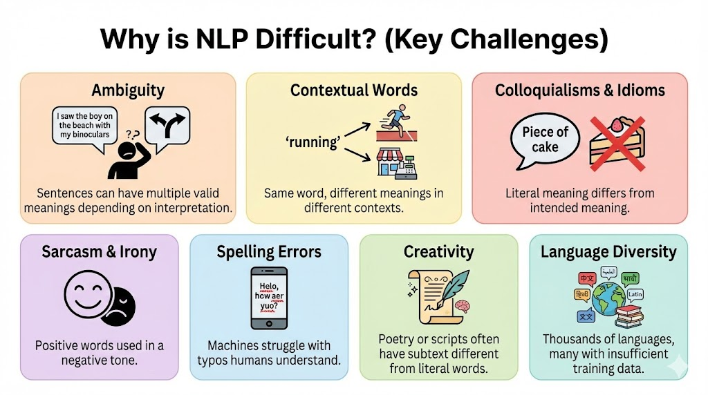
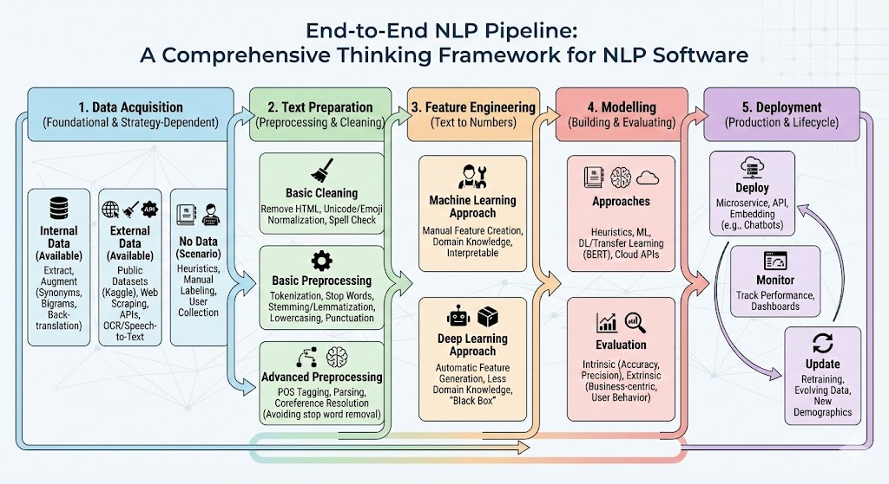
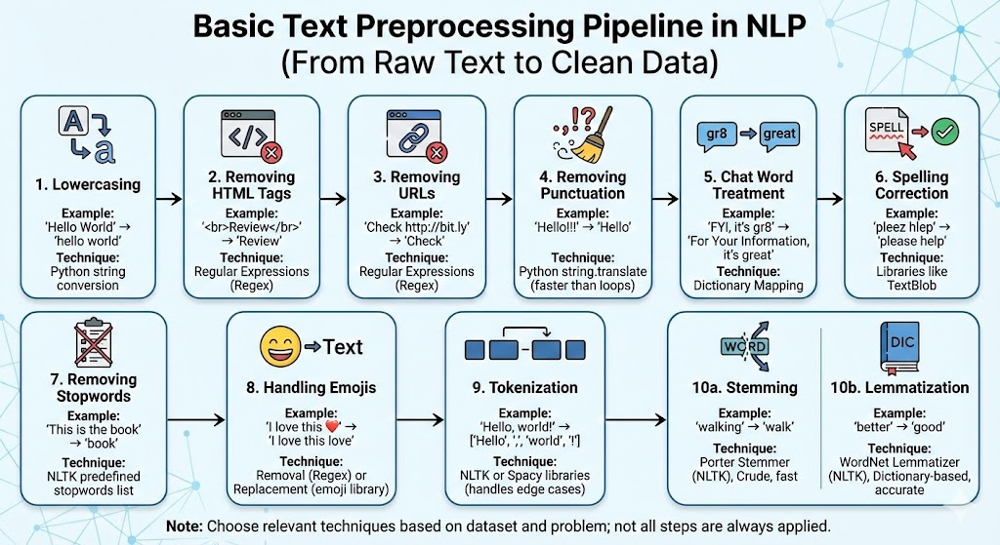
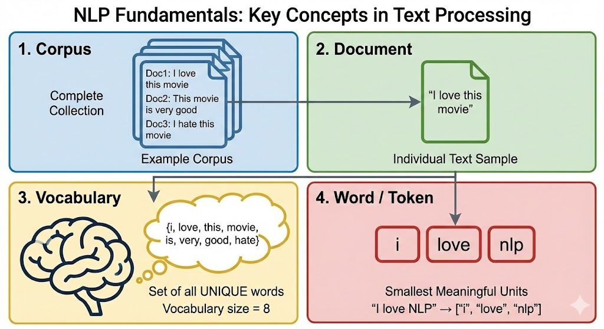
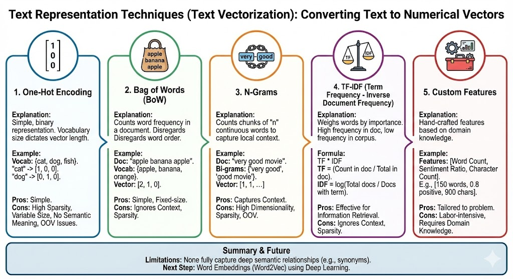

# Natural Language Processing (NLP)

## M1 - Introduction To NLP

### **Overview and Definition**
**Natural Language Processing (NLP)** is defined as a field comprised of three disciplines: **Linguistics** (human language), **Computer Science**, and **Artificial Intelligence**. Its primary goal is not only to enable machines to understand natural language but also to communicate and respond in it.

### **The Need for NLP**
The speaker argues that NLP represents the next frontier in human evolution. Just as language and machines were the two major factors in human progress historically, the ability to communicate with machines as naturally as we do with other humans is the next step. The objective is to move away from specialized programming or graphical interfaces (buttons/touch) toward seamless interaction via natural speech and text.

### **Real-World A### **Overview and Definition**
**Natural Language Processing (NLP)** is defined as a field comprised of three disciplines: **Linguistics** (human language), **Computer Science**, and **Artificial Intelligence**. Its primary goal is not only to enable machines to understand natural language but also to communicate and respond in it.

### **The Need for NLP**
The speaker argues that NLP represents the next frontier in human evolution. Just as language and machines were the two major factors in human progress historically, the ability to communicate with machines as naturally as we do with other humans is the next step. The objective is to move away from specialized programming or graphical interfaces (buttons/touch) toward seamless interaction via natural speech and text.

### **Real-World Applications**
The lecture highlights several current applications of NLP:
*   **Contextual Advertisements:** Companies analyze chat logs and user behavior to target ads based on specific interests (e.g., discussing sports leads to sports equipment ads).
*   **Email Clients:** Features like spam filtering, smart replies, and email categorization (e.g., Gmail) rely on NLP.
*   **Social Media:** Platforms use NLP to filter adult content, block hate speech, and perform "Opinion Mining" (e.g., predicting election results by analyzing sentiment in tweets).
*   **Search Engines:** Google uses NLP to answer direct questions (e.g., "Capital of Sri Lanka") with specific answers rather than just links.
*   **Chatbots:** Automated customer service agents that handle initial queries before routing complex issues to humans.

### **Common NLP Tasks**
If one wishes to become an NLP engineer, there are approximately 10–12 core tasks to master:
1.  **Text/Document Classification:** Assigning categories to text (e.g., classifying news as sports or politics).
2.  **Sentiment Analysis:** Determining the emotion behind text (e.g., analyzing product reviews).
3.  **Information Retrieval:** Extracting specific entities like names or places from text.
4.  **Parts of Speech (POS) Tagging:** Identifying nouns, verbs, and adjectives in a sentence.
5.  **Language Detection & Machine Translation:** Converting text from one language to another (e.g., Google Translate).
6.  **Conversational Agents:** Building text-based or speech-based bots (e.g., Siri).
7.  **Knowledge Graphs & QA Systems:** Linking entities to answer factual questions (e.g., "Who is the PM of Japan?").
8.  **Text Summarization:** Condensing long articles into short summaries (e.g., InShorts app).
9.  **Topic Modeling:** Identifying broad topics (like "Cricket") within a large corpus of text using algorithms like LDA.
10. **Text Generation:** Predicting the next word or sentence (e.g., autocomplete).
11. **Spell Checking & Grammar Correction:** Tools like Grammarly.
12. **Speech-to-Text:** Converting spoken language into written text.
pplications**
The lecture highlights several current applications of NLP:
*   **Contextual Advertisements:** Companies analyze chat logs and user behavior to target ads based on specific interests (e.g., discussing sports leads to sports equipment ads).
*   **Email Clients:** Features like spam filtering, smart replies, and email categorization (e.g., Gmail) rely on NLP.
*   **Social Media:** Platforms use NLP to filter adult content, block hate speech, and perform "Opinion Mining" (e.g., predicting election results by analyzing sentiment in tweets).
*   **Search Engines:** Google uses NLP to answer direct questions (e.g., "Capital of Sri Lanka") with specific answers rather than just links.
*   **Chatbots:** Automated customer service agents that handle initial queries before routing complex issues to humans.

### **Common NLP Tasks**
If one wishes to become an NLP engineer, there are approximately 10–12 core tasks to master:
1.  **Text/Document Classification:** Assigning categories to text (e.g., classifying news as sports or politics).
2.  **Sentiment Analysis:** Determining the emotion behind text (e.g., analyzing product reviews).
3.  **Information Retrieval:** Extracting specific entities like names or places from text.
4.  **Parts of Speech (POS) Tagging:** Identifying nouns, verbs, and adjectives in a sentence.
5.  **Language Detection & Machine Translation:** Converting text from one language to another (e.g., Google Translate).
6.  **Conversational Agents:** Building text-based or speech-based bots (e.g., Siri).
7.  **Knowledge Graphs & QA Systems:** Linking entities to answer factual questions (e.g., "Who is the PM of Japan?").
8.  **Text Summarization:** Condensing long articles into short summaries (e.g., InShorts app).
9.  **Topic Modeling:** Identifying broad topics (like "Cricket") within a large corpus of text using algorithms like LDA.
10. **Text Generation:** Predicting the next word or sentence (e.g., autocomplete).
11. **Spell Checking & Grammar Correction:** Tools like Grammarly.
12. **Speech-to-Text:** Converting spoken language into written text.

### Approaches to Solving NLP Problems (With Examples)

This document explains the evolution of NLP approaches and why NLP is
hard, using clear real-world examples.


#### 1. Heuristic Methods (Rule-Based NLP)

##### What it is

Early NLP systems relied on **manually written rules** created by
humans. These rules tried to capture language patterns explicitly.

##### Example: Sentiment Analysis

**Rule:**\
If a sentence contains more positive words than negative words →
sentiment is positive.

``` text
Sentence: "The movie was good and amazing"
Positive words: good, amazing (2)
Negative words: 0
Output: Positive
```

##### Tools Used

-   **Regex:**\
    Used to find patterns.

    ``` regex
    \d{10}
    ```

    Matches a 10-digit phone number.

-   **WordNet:**\
    Understands word relationships.

    ``` text
    happy → synonym → joyful
    hot → antonym → cold
    ```

-   **Open Mind Common Sense:**\
    Stored basic human knowledge.

    ``` text
    "Fire is hot"
    "Ice is cold"
    ```

##### Pros

-   Fast
-   Accurate for narrow tasks
-   Easy to debug

##### Cons

-   Breaks for unseen cases
-   Cannot handle sarcasm or creativity
-   Not scalable

``` text
Sentence: "Yeah great, another Monday 🙄"
Rule-based output: Positive ❌
Actual meaning: Negative
```


#### 2. Machine Learning (ML-Based NLP)

##### What it is

Instead of rules, machines **learn patterns from data** by converting
text into numbers.

##### Example: Spam Detection

Training data:

``` text
"Win a free iPhone" → Spam
"Meeting at 10 AM" → Not Spam
```

Text is converted into vectors:

``` text
"free" = 1
"win" = 1
"meeting" = 0
```

A classifier learns:

``` text
If words like "free", "win", "offer" appear → Spam
```

##### Common Algorithms

-   Naive Bayes
-   Logistic Regression
-   SVM
-   LDA
-   Hidden Markov Models (HMM)

##### Limitation Example

``` text
"I am not happy"
"I am happy"
```

Bag-of-words treats both as similar ❌\
Word order and context are lost.


#### 3. Deep Learning (DL-Based NLP)

#### Why DL?

DL models understand **sequence and context**, which ML models cannot.

##### RNN Example

``` text
Sentence: "I grew up in France. I speak ____."
```

RNN remembers "France" → predicts "French"

##### LSTM / GRU

Fixes RNN memory loss:

``` text
"I watched a movie yesterday. The movie was boring."
```

Model remembers what "movie" refers to.

##### CNNs in NLP

Used for: - Sentence classification - Keyword extraction

They detect local patterns like:

``` text
"not good"
"very bad"
```


#### Transformer Revolution (2015)

##### Key Idea: Attention

Models focus on **important words**.

``` text
Sentence: "The animal didn't cross the street because it was tired."
```

Attention links **it → animal**, not street.

##### BERT Example

Understands bidirectional context:

``` text
"I went to the bank to deposit money"
"I sat on the bank of the river"
```

Same word, different meaning ✔️



### Why is NLP Difficult? (With Examples)

#### 1. Ambiguity

``` text
"I saw the boy on the beach with my binoculars"
```

-   I used binoculars
-   The boy had binoculars

Machines struggle to choose correctly.


#### 2. Contextual Words

``` text
"He is running a company"
"He is running fast"
```

Same word, different meanings.


#### 3. Idioms & Colloquialisms

``` text
"Piece of cake"
```

Literal: dessert ❌\
Actual: easy ✔️

#### 4. Sarcasm & Irony

``` text
"Awesome, my code crashed again"
```

Positive word, negative intent.


#### 5. Spelling Errors

``` text
"I realy love this"
```

Humans understand ✔️\
Machines may fail ❌

#### 6. Creativity & Subtext

``` text
"All the world's a stage"
```

Not literal --- metaphorical meaning.

#### 7. Language Diversity

-   7000+ languages
-   Many have **low data**
-   Models fail without training examples


### Summary

  | Approach     | Strength            | Weakness      |
  | ------------ | ------------------- | ------------- |
  | Rule-Based   | Fast & precise      | Not flexible  |
  | ML           | Learns patterns     | Loses context |
  | DL           | Understands context | Data-hungry   |
  | Transformers | Best performance    | Expensive     |
  
--------------------------------------------------------------


## M2 - End to End NLP Pipeline

### Overview of the NLP Pipeline

The NLP pipeline consists of **five non-linear stages**:

1.  Data Acquisition
2.  Text Preparation (Preprocessing)
3.  Feature Engineering
4.  Modelling
5.  Deployment

These steps are iterative --- engineers often move back and forth
between them.


### 1. Data Acquisition

This is the **foundation** of any NLP system. The approach depends on
whether data exists.


#### Case 1: Data Available Internally

**Example:**\
A company wants to build a **customer complaint classifier**.

-   Data already exists in a database:

``` text
customer_id | complaint_text | category
```

-   Data engineers extract this data using SQL or ETL pipelines.

##### When Data is Small → Data Augmentation

If only 500 complaints exist, augmentation is used:

  | Technique           | Example                        |
  | ------------------- | ------------------------------ |
  | Synonym Replacement | "bad service" → "poor service" |
  | Bigrams             | "credit card"                  |
  | Back Translation    | English → French → English     |
  | Noise Injection     | Adding minor typos             |

This increases dataset size without new users.


#### Case 2: Data Available Externally

**Example:**\
Building a **movie review sentiment analyzer**.

Sources: - Kaggle movie review datasets - Scraping IMDb reviews using
BeautifulSoup - APIs like RapidAPI

If data is not text: - **PDFs** → OCR - **Audio** → Speech-to-Text - **Images** → OCR


#### Case 3: No Data Available

**Example:**\
A startup wants to detect **toxic chat messages** but has no history.

Solutions: - Rule-based heuristics:

``` text
If message contains banned words → flag
```

-   Manual labeling by employees
-   Collect data from users post-launch


### 2. Text Preparation (Preprocessing)

Raw text is noisy and must be cleaned.


#### Level 1: Basic Cleaning

**Input:**

``` text
"I ❤️ this product!!! <br>"
```

**After cleaning:**

``` text
"I love this product"
```

Includes: - Removing HTML tags - Emoji normalization - Spelling correction


#### Level 2: Basic Preprocessing

##### Tokenization

``` text
"I love NLP"
→ ["I", "love", "NLP"]
```

##### Stop Word Removal

``` text
"I love NLP"
→ ["love", "NLP"]
```

##### Stemming / Lemmatization

``` text
"dancing", "danced" → "dance"
```

Other operations: - Lowercasing - Removing punctuation - Language
detection


#### Level 3: Advanced Preprocessing

Used in chatbots and QA systems.

##### POS Tagging

``` text
"I am running a company"
running → Verb
```

##### Parsing

Understands sentence structure:

``` text
"The cat sat on the mat"
```

##### Coreference Resolution

``` text
"Ravi went home. He was tired."
He → Ravi
```

⚠️ Stop words should NOT be removed when POS tagging is required.


### 3. Feature Engineering

Machines cannot understand text directly --- it must be converted to
numbers.


#### Basic Features (Heuristic)

**Example: Sentiment**

``` text
Positive words = 3
Negative words = 1
```

Prediction based on counts.


#### Machine Learning Features

##### Bag of Words

``` text
"I love NLP"
→ [1,1,1,0,0]
```

##### TF-IDF

Gives importance to rare but meaningful words.


#### Deep Learning Features

**Word2Vec / Embeddings**

``` text
king - man + woman ≈ queen
```

Features are **learned automatically** by the model.

  | Approach | Pros          | Cons          |
  | -------- | ------------- | ------------- |
  | ML       | Interpretable | Manual effort |
  | DL       | Automatic     | Black box     |


### 4. Modelling

This is where learning happens.


#### Modelling Choices

##### Heuristics

``` text
If email from boss → important
```

Used when data is limited.

##### Machine Learning

-   Naive Bayes
-   Logistic Regression
-   SVM

Used for moderate datasets.

##### Deep Learning / Transfer Learning

-   LSTM
-   BERT
-   GPT

Used for large data or complex tasks.

##### Cloud APIs

-   Google NLP
-   AWS Comprehend

Used when speed \> control.


#### Evaluation

##### Intrinsic Evaluation (Technical)

-   Accuracy
-   Precision / Recall
-   Perplexity

##### Extrinsic Evaluation (Business)

``` text
Did user click the suggestion?
Did chatbot resolve the query?
```

A model may score high technically but fail business goals.


### 5. Deployment

Making the model usable.


#### Deployment Options

-   REST API
-   Microservice
-   Embedded in mobile/web apps
-   Chatbots

**Example:**

``` text
POST /predict
Input: "Refund not received"
Output: Billing Issue
```


#### Monitoring

Track: - Accuracy drop - Data drift - Latency

Dashboards are used for alerts.


#### Updating

Models must evolve: - New slang - New users - New regions

Retraining is essential.


### Final Summary

  | Stage               | Purpose                 |
  | ------------------- | ----------------------- |
  | Data Acquisition    | Collect reliable data   |
  | Text Preparation    | Clean & structure text  |
  | Feature Engineering | Convert text to numbers |
  | Modelling           | Learn patterns          |
  | Deployment          | Deliver value           |



---

## M3 - Text Preprocessing

### Overview
The goal of preprocessing is to convert **raw, noisy human language** into **clean, consistent, machine-readable text** that improves ML model performance.

> ⚠️ Not all steps are mandatory. Choose techniques based on your **dataset**, **task**, and **model**.

---

### Example Raw Sentence
```
"I LOVED this movie!!! 😍😍 <br> Check it out at https://imdb.com FYI it's gr8!!!"
```

---

### 1. Lowercasing
**What:** Convert text to lowercase  
**Why:** Avoids treating `Loved`, `loved`, and `LOVED` as different words  

**Example**
```
Before: I LOVED this movie
After : i loved this movie
```


### 2. Removing HTML Tags
**Problem:** Web data often contains HTML meant for browsers  
**Technique:** Regular Expressions (Regex)

**Example**
```
Before: movie <br> check this
After : movie  check this
```


### 3. Removing URLs
**Problem:** URLs rarely help in tasks like sentiment analysis  
**Technique:** Regex

**Example**
```
Before: check https://imdb.com
After : check
```

### 4. Removing Punctuation
**Problem:** `movie!`, `movie!!`, and `movie` become different tokens  
**Efficient Technique:** `string.translate`

**Example**
```
Before: movie!!!
After : movie
```

✔ Faster than loops  
✔ Suitable for large datasets  

### 5. Chat Word Treatment (Slang Expansion)
**Problem:** Models cannot infer slang meaning  

**Example Mapping**
```
FYI  -> for your information
gr8  -> great
```

**Example**
```
Before: FYI it's gr8
After : for your information it's great
```

### 6. Spelling Correction
**Problem:** Typos increase vocabulary size  

**Example**
```
Before: pleez watch this
After : please watch this
```

**Tool:** TextBlob  
⚠️ Can be slow and risky for domain-specific text


### 7. Removing Stopwords
**What:** Remove high-frequency grammar words  

**Example**
```
Before: this is a very good movie
After : good movie
```

✔ Reduces noise  
✔ Shrinks feature space  

⚠️ Avoid for tasks like **translation**, **summarization**, **NER**


### 8. Handling Emojis

#### Option 1: Remove Emojis
```
i loved this 😍 → i loved this
```

#### Option 2: Replace Emojis with Meaning
```
i loved this 😍 → i loved this smiling face with heart eyes
```

✔ Replacement works better for sentiment analysis  


### 9. Tokenization
**What:** Splitting text into words or sentences  

**Why not `split()`?**
```
Ph.D. costs Rs. 20
```

Naive splitting breaks meaning.

**Recommended Tools**
- NLTK
- **Spacy (best for real-world text)**


### 10. Stemming vs Lemmatization

#### Stemming (Fast, Heuristic)
Stemming is a rule-based, heuristic chopping process.

It blindly removes suffixes like:
```
-ing, -ed, -ly, -s
```
It does not care if the result is a real English word.
```
playing   → play
running   → run
happiness → happi ❌
daily     → dai ❌
```

✔ Fast  
❌ Not linguistically accurate  


#### Lemmatization (Accurate, Slower)
Lemmatization is a linguistic process.

It:

- Uses a dictionary
- Understands grammar
- Converts words to their valid root form (lemma)

Example
```
running → run
better  → good
wolves  → wolf
```

✔ Dictionary words  
✔ Requires Part-of-Speech (POS)


### End-to-End Example

**Raw Text**
```
"I LOVED this movie!!! 😍 <br> FYI it's gr8!!!"
```

**After Preprocessing**
```
loved movie for your information great
```


### Key Takeaways
- Preprocessing is a **toolbox**, not a checklist
- Select steps based on:
  - Dataset (tweets, reviews, chats)
  - Task (sentiment, classification, NER)
  - Model (ML vs Transformers like BERT)


### Best Practice Tip
Modern transformer models (BERT, GPT):
- ❌ Do NOT remove stopwords
- ❌ Do NOT stem/lemmatize
- ✅ Minimal cleaning only (HTML, URLs)



---


## M4 - Text Representation

### Overview: Why Text Representation Matters
Machine Learning models **cannot understand raw text**.  
Text must be converted into **numerical vectors** that preserve meaning as much as possible.  
This process is called **Feature Extraction** or **Text Vectorization**.

> ⚠️ Poor representation → Poor model performance  
> (Garbage In → Garbage Out)

### Core Terminology (Very Important)

#### 1. Corpus
A **corpus** is the complete collection of documents used for training.

**Example Corpus**
```
Doc1: I love this movie
Doc2: This movie is very good
Doc3: I hate this movie
```

#### 2. Document
A **document** is one individual text sample inside the corpus.

**Example**
```
"I love this movie"
```

---

#### 3. Vocabulary
The **vocabulary** is the set of all **unique words** in the corpus.

**Vocabulary**
```
{i, love, this, movie, is, very, good, hate}
```

Vocabulary size = 8

---

#### 4. Word / Token
A **word (token)** is the smallest meaningful unit after tokenization.

**Example**
```
"I love NLP" → ["i", "love", "nlp"]
```


### 1. One‑Hot Encoding

#### How it Works
Each word in the vocabulary becomes a **vector** of length = vocabulary size.  
Only **one position is 1**, rest are 0.

#### Vocabulary
```
{i, love, movie}
```

#### One‑Hot Vectors
```
i     → [1, 0, 0]
love  → [0, 1, 0]
movie → [0, 0, 1]
```

#### Example Document
```
"I love movie"
```

Representation:
```
i     → [1,0,0]
love  → [0,1,0]
movie → [0,0,1]
```


#### Limitations
❌ Extremely sparse  
❌ No semantic meaning  
❌ Cannot handle new words (OOV)  
❌ Vocabulary growth breaks models  


### 2. Bag of Words (BoW)

#### Core Idea
Instead of presence, **count word frequency**.  
Word order is ignored.


#### Corpus
```
Doc1: I love this movie
Doc2: I hate this movie
```

#### Vocabulary
```
[i, love, hate, this, movie]
```

#### BoW Representation

| Document | i   | love | hate | this | movie |
| -------- | --- | ---- | ---- | ---- | ----- |
| Doc1     | 1   | 1    | 0    | 1    | 1     |
| Doc2     | 1   | 0    | 1    | 1    | 1     |

#### Problem Example
```
"This movie is very good"
"This movie is not very good"
```

BoW vectors will be **almost identical** ❌  
Context is lost.


### 3. N‑Grams (Bag of N‑Grams)

#### What are N‑Grams?
Continuous sequences of **n words**.

- Unigram → 1 word
- Bigram → 2 words
- Trigram → 3 words


#### Sentence
```
"This movie is very good"
```

#### Bigrams
```
this movie
movie is
is very
very good
```

#### Why N‑Grams Help
```
"very good" ≠ "not good"
```

They capture **local context**, which BoW misses.


#### Trade‑offs
❌ Vocabulary size explodes  
❌ High sparsity  
❌ Slower models  


### 4. TF‑IDF (Term Frequency – Inverse Document Frequency)

#### Why TF‑IDF?
BoW treats **all words equally**, which is wrong.

TF‑IDF assigns **importance**.


#### Term Frequency (TF)
Measures how often a word appears **inside a document**.

```
TF(word) = (no. of occurance of term t in document d) / (total no. of words present in document d)
```


#### Inverse Document Frequency (IDF)
Measures how **rare** a word is across the corpus.

```
IDF(word) = log(Total Docs in corpus / no. of document with term t in them)
```

#### Example Corpus
```
Doc1: this movie is good
Doc2: this movie is bad
Doc3: this movie is very good
```

- "this", "movie", "is" → appear everywhere → low IDF
- "very" → appears once → high IDF


#### TF‑IDF Effect
```
Common words → low weight
Rare but meaningful words → high weight
```

✔ Excellent for **search engines**  
✔ Strong baseline for ML classifiers  


### 5. Custom (Hand‑Crafted) Features

#### Why Needed?
Statistical vectors may miss **domain‑specific signals**.


#### Examples

| Feature             | Description                        |
| ------------------- | ---------------------------------- |
| Positive word count | Number of positive sentiment words |
| Negative word count | Number of negative words           |
| Review length       | Total words                        |
| Exclamation count   | Emotion indicator                  |
| Uppercase ratio     | Aggression / emphasis              |


#### Example
```
"I ABSOLUTELY love this movie!!!"
```

Features:
```
positive_words = 1
exclamations = 3
uppercase_ratio = high
```

### Summary Table

| Technique | Captures Meaning | Context | Sparsity |
| --------- | ---------------- | ------- | -------- |
| One‑Hot   | ❌                | ❌       | 🔥🔥🔥      |
| BoW       | ⚠️                | ❌       | 🔥🔥       |
| N‑Grams   | ⚠️                | ⚠️       | 🔥🔥🔥      |
| TF‑IDF    | ⚠️                | ❌       | 🔥🔥       |
| Custom    | ✅ (partial)      | ⚠️       | Depends  |


### Final Note
These methods **do not understand semantics**:
```
beautiful ≠ gorgeous (numerically)
```

This limitation led to **Word Embeddings (Word2Vec, GloVe)**  
and later **Transformers (BERT, GPT)**.


### Key Takeaway
> Classical vectorization counts words.  
> Modern NLP learns meaning.
